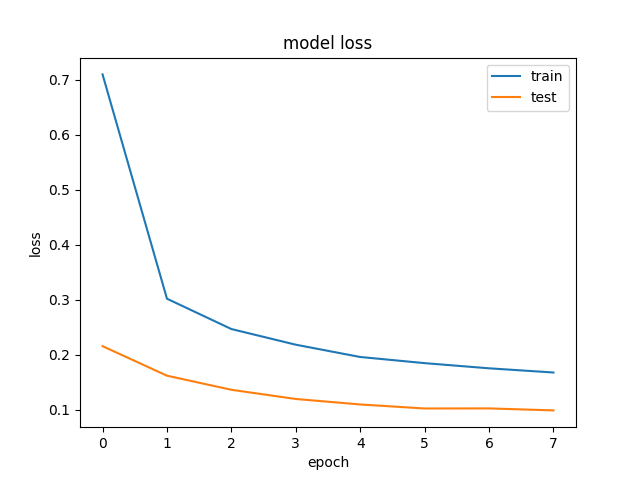
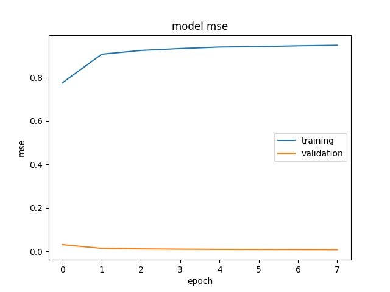

# *****Comparison of effectiveness of Regular and Convolutional Neural Networks in handwritten series recognition.***** 

#### **DataSet :** MNIST

#### **CPU :** Intel i7-8750H 2.2 GHz (***TurboBoost off***)

## **RNN**

#### **batch size :** 128
#### **number of epochs :** 8 
#### **number of parameters :** 12 975 
#### **accuracy :** ~94.5% 
#### **loss :** ~0.173 
#### **mse :** ~0.0079 
#### **time of training :** ~10s 

### **Accuracy plot :**

### **Loss plot :**

### **MSE plot :**

## **CNN**

#### **batch size :** 128 
#### **number of epochs :** 8 
#### **number of parameters :** 12 980 
#### **accuracy :** ~96.5% 
#### **loss :** ~0.104 
#### **mse :** ~0.0049 
#### **time of training :** ~50s 

### **Accuracy plot :**

### **Loss plot :**

### **MSE plot :**
